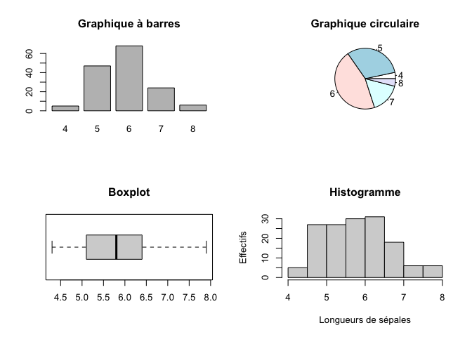

<!-- README.md is generated from README.Rmd. Please edit that file -->

# Graphical Parameters

<!-- badges: start -->

<!-- badges: end -->

Ce tutoriel propose de découvrir et manipuler les principaux paramètres
graphiques de R-base par une série de 10 exercices.

Ces exercices se répartissent sur différent grand thèmes de découvertes
: positionner les figures dans l’espace d’affichage ; choisir les
colorations ; sélectionner le type et la forme des tracés ; ajouter et
contrôler les paramètres textuels ; paramétrer les axes ; zoomer et
cadrer les parties à afficher ; modifier l’orientation des labels.

## Installation

Vous pouvez installer la dernière version de Graphical.Parameters depuis
le [CRAN](https://CRAN.R-project.org) avec:

``` r
install.packages("Graphical.Parameters")
```

## Exemple

Il arrive de vouloir observer diverses représentations simultanément,
plutôt que de les regarder une à une, comme proposé par défaut.

Pour positionner les figures dans l’espace de visualisation, il est
possible de diviser l’espace comme un tableau à i lignes et j colonnes.
Ceci s’oppère avec les paramètres `mfrow` ou `mfcol` selon
**par(mfrow=c(1,2))** ou **par(mfcol=c(1,2))**

Voici un exemple, où nous utilisons `mfrow` pour mettre quatre
graphiques côte à côte.

``` r
# Nous divisons l'espace d'affichage en un tableau à deux lignes et deux colonnes
par(mfrow=c(2,2)) 
# Histogramme des longueurs de sépales arrondies à un chiffre
barplot(table(round(iris$Sepal.Length,0)), main="Graphique à barres") 
# Diagramme circulaire à secteurs des longueurs de sépales arrondies à un chiffre
pie(table(round(iris$Sepal.Length,0)), main="Graphique circulaire", radius=1) 
# Boxplot des longueurs de sépales
boxplot(main="Boxplot",iris$Sepal.Length, horizontal=TRUE)
# Histogramme des longueurs de sépales
hist(iris$Sepal.Length, main="Histogramme",xlab="Longueurs de sépales",ylab="Effectifs")
```


